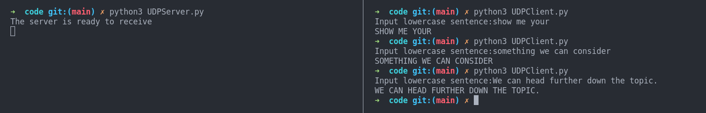
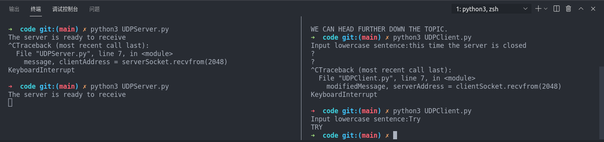
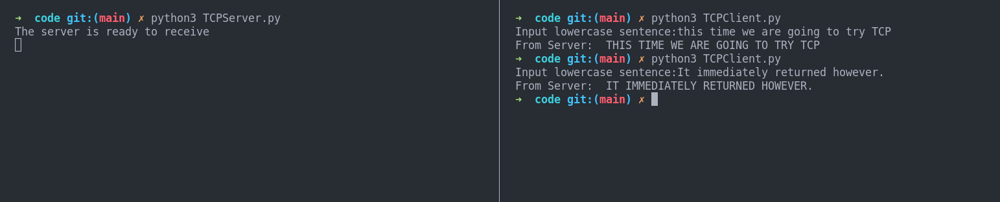
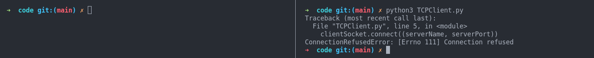
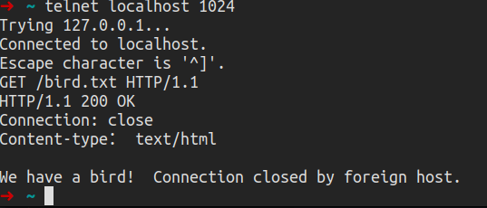
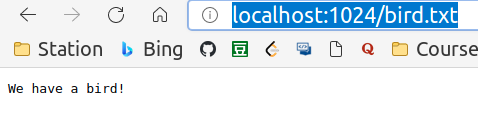
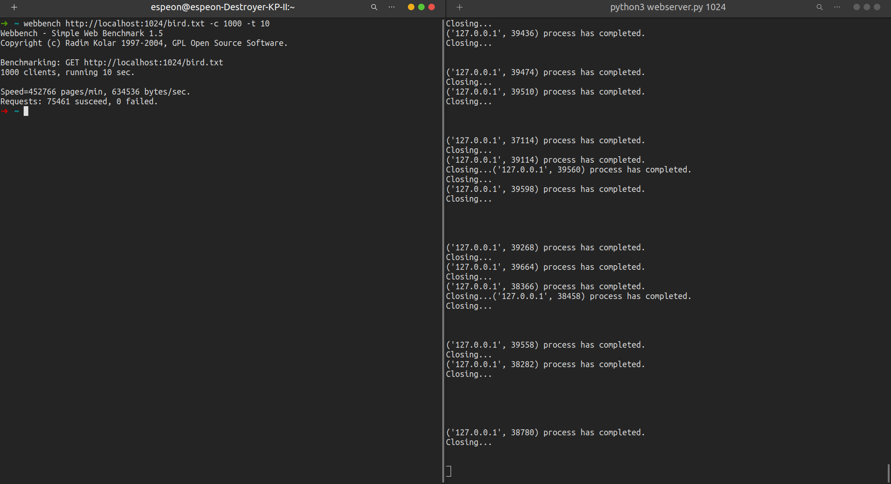
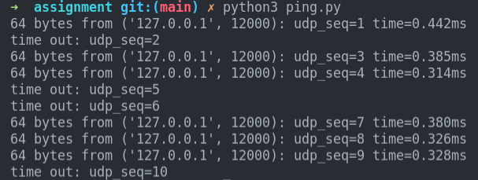

# Chapter 2 Application Layer  

## Code  

### UDP

[UDPClient.py](./code/UDPClient.py)  
[UDPServer.py](./code/UDPServer.py)  

  

This time we close down the server, and there's no response to the following requests of the client:  

  

### TCP  

[TCPClient.py](./code/TCPClient.py)  
[TCPServer.py](./code/TCPServer.py)  

  

If we shut down the server, the client will panic:  

  

## Assignment

### Assignment 1: Web Server  

1. In this assignment, you will develop a simple Web server in Python that is capable of processing only one request. Specifically, your Web server will (i) create a connection socket when contacted by a client (browser); (ii) receive the HTTP request from this connection; (iii) parse the request to determine the specific file being requested; (iv) get the requested file from the server’s file system; (v) create an HTTP response message consisting of the requested file preceded by header lines; and (vi) send the response over the TCP connection to the requesting browser. If a browser requests a file that is not present in your server, your server should return a “404 Not Found” error message. In the Companion Website, we provide the skeleton code for your server. Your job is to complete the code, run your server, and then test your server by sending requests from browsers running on different hosts. If you run your server on a host that already has a Web server running on it, then you should use a different port than port 80 for your Web server.  

[webserver.py](./assignment/webserver.py)  

Open two terminal:  

In the first terminal, we launch the server and leave it on:  

`cd assignment`  
`python3 webserver.py <port number>`  

We can use three different methods:  

Firstly, `Telnet`  

  

Secondly, type the link into your desired browser manually:  

  

Third, use `webbench`  

  

### Assignment 2: UDP Pinger  

In this programming assignment, you will write a client ping program in Python.
Your client will send a simple ping message to a server, receive a corresponding
pong message back from the server, and determine the delay between when the client sent the ping message and received the pong message. This delay is called the Round
Trip Time (RTT). The functionality provided by the client and server is similar to the
functionality provided by standard ping program available in modern operating sys-
tems. However, standard ping programs use the Internet Control Message Protocol
(ICMP) (which we will study in Chapter 5). Here we will create a nonstandard (but
simple!) UDP-based ping program.
Your ping program is to send 10 ping messages to the target server over UDP.
For each message, your client is to determine and print the RTT when the corre-
sponding pong message is returned. Because UDP is an unreliable protocol, a packet
sent by the client or server may be lost. For this reason, the client cannot wait indefi-
nitely for a reply to a ping message. You should have the client wait up to one second
for a reply from the server; if no reply is received, the client should assume that the
packet was lost and print a message accordingly.
In this assignment, you will be given the complete code for the server (available
in the Companion Website). Your job is to write the client code, which will be very
similar to the server code. It is recommended that you first study carefully the server
code. You can then write your client code, liberally cutting and pasting lines from
the server code.

[ping.py](./assignment/ping.py)  

- Corresponding server: [Server.py](./assignment/Server.py)  

